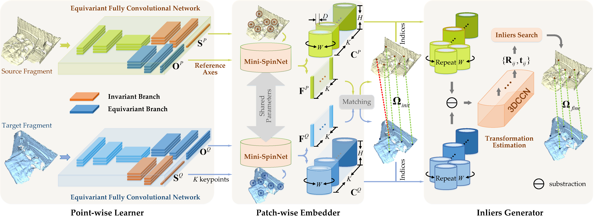

[](https://creativecommons.org/licenses/by-nc-sa/4.0/legalcode)
## BUFFER: Balancing Accuracy, Efficiency, and Generalizability in Point Cloud Registration (CVPR 2023)

This is the official repository of **BUFFER**, a point cloud registration method for balancing accuracy, efficiency, and generalizability. For technical details, please refer to:

**[BUFFER: Balancing Accuracy, Efficiency, and Generalizability in Point Cloud Registration](https://openaccess.thecvf.com/content/CVPR2023/html/Ao_BUFFER_Balancing_Accuracy_Efficiency_and_Generalizability_in_Point_Cloud_Registration_CVPR_2023_paper.html)**  <br />
[Sheng Ao](http://scholar.google.com/citations?user=cvS1yuMAAAAJ&hl=zh-CN), [Qingyong Hu](https://www.cs.ox.ac.uk/people/qingyong.hu/), [Hanyun Wang](https://scholar.google.com.hk/citations?user=QG3LdUcAAAAJ&hl=zh-CN), [Kai Xu](https://scholar.google.com/citations?user=GuVkg-8AAAAJ), [Yulan Guo](http://yulanguo.me/). <br />

**[[Paper](https://openaccess.thecvf.com/content/CVPR2023/html/Ao_BUFFER_Balancing_Accuracy_Efficiency_and_Generalizability_in_Point_Cloud_Registration_CVPR_2023_paper.html)] [[Video](https://www.youtube.com/watch?v=STmAkRWuSiY)] [Project page]** <br />


### (1) Overview



### (2) Setup
This code has been tested with Python 3.8, Pytorch 1.9.1, CUDA 11.1 on Ubuntu 20.04.
 
- Clone the repository 
```
git clone https://github.com/aosheng1996/BUFFER && cd BUFFER
```
- Setup conda virtual environment
```
conda create -n buffer python=3.8
source activate buffer
pip install torch==1.9.1+cu111 torchvision==0.10.1+cu111 torchaudio==0.9.1 -f https://download.pytorch.org/whl/torch_stable.html
pip install open3d==0.13.0

export CUDA_HOME=/your/cuda/home/directory/
pip install "git+git://github.com/erikwijmans/Pointnet2_PyTorch.git#egg=pointnet2_ops&subdirectory=pointnet2_ops_lib"
pip install --upgrade https://github.com/unlimblue/KNN_CUDA/releases/download/0.2/KNN_CUDA-0.2-py3-none-any.whl
pip install ninja kornia einops easydict tensorboard tensorboardX
pip install nibabel -i http://pypi.douban.com/simple --trusted-host pypi.douban.com
cd cpp_wrappers && sh compile_wrappers.sh && cd ..
git clone https://github.com/KinglittleQ/torch-batch-svd.git && cd torch-batch-svd && python setup.py install && cd .. && sudo rm -rf torch-batch-svd/
```

### (3) 3DMatch
Following [Predator](https://github.com/prs-eth/OverlapPredator.git), we provide the processed 3DMatch training set (subsampled fragments with voxel size of 1.5cm and their ground truth transformation matrices). 

Download the processed dataset from [Google Drive](https://drive.google.com/drive/folders/1tWVV4u_YablYmPta8fmHLY-JN4kZWh8R?usp=sharing) and put the folder into `data`. 
Then the structure should be as follows:

- `data`
    - `ThreeDMatch`
        - `train`
            - `7-scenes-chess`
            - ...
            - `3DMatch_train_overlap.pkl`
            - `train_3dmatch.txt`
            - `val_3dmatch.txt`
        - `test`
            - `3DLoMatch`
            - `3DMatch`

**Training**

Training BUFFER on the 3DMatch dataset:
```
cd ./ThreeDMatch
python train.py
```
**Testing**

Evaluate the performance of the trained models on the 3DMatch dataset:

```
cd ./ThreeDMatch
python test.py
```
To evaluate the performance of BUFFER on the 3DLoMatch dataset, you only need to modify the `_C.data.dataset = '3DMatch'` in `config.py` to `_C.data.dataset = '3DLoMatch'` and performs:
```
python test.py
``` 

### (4) KITTI
Download the data from the [KITTI Odometry website](http://www.cvlibs.net/datasets/kitti/eval_odometry.php) into `data`. 
Then the structure is as follows:

- `data`
    - `KITTI`
        - `dataset`
            - `pose`
                - `00.txt`
                - ...
            - `sequences`
                - `00`
                - ...

**Training**

Training BUFFER on the KITTI dataset:

```
cd ./KITTI
python train.py
```

**Testing**

Evaluate the performance of the trained models on the KITTI dataset:

```
cd ./KITTI
python test.py
```

### (5) ETH

The test set can be downloaded from [here](https://share.phys.ethz.ch/~gsg/3DSmoothNet/data/ETH.rar), and put the folder into `data`, then the structure is as follows:

- `data`
    - `ETH`
        - `gazebo_summer`
        - `gazebo_winter`
        - `wood_autmn`
        - `wood_summer`


### (6) Generalizing to Unseen Datasets 

**3DMatch to ETH**

Generalization from 3DMatch dataset to ETH dataset:
```
cd ./generalization/ThreeD2ETH
python test.py
```

**3DMatch to KITTI**

Generalization from 3DMatch dataset to KITTI dataset:

```
cd ./generalization/ThreeD2KITTI
python test.py
```

**KITTI to 3DMatch**

Generalization from KITTI dataset to 3DMatch dataset:
```
cd ./generalization/KITTI2ThreeD
python test.py
```

**KITTI to ETH**

Generalization from KITTI dataset to ETH dataset:
```
cd ./generalization/KITTI2ETH
python test.py
```

## Acknowledgement

In this project, we use (parts of) the implementations of the following works:

* [Vector Neurons](https://github.com/FlyingGiraffe/vnn)
* [D3Feat](https://github.com/XuyangBai/D3Feat.pytorch)
* [PointDSC](https://github.com/XuyangBai/PointDSC)
* [SpinNet](https://github.com/QingyongHu/SpinNet)
* [GeoTransformer](https://github.com/qinzheng93/GeoTransformer)
* [RoReg](https://github.com/HpWang-whu/RoReg)

### Citation
If you find our work useful in your research, please consider citing:

    @inproceedings{ao2023buffer,
      title={BUFFER: Balancing Accuracy, Efficiency, and Generalizability in Point Cloud Registration},
      author={Ao, Sheng and Hu, Qingyong and Wang, Hanyun and Xu, Kai and Guo, Yulan},
      booktitle={Proceedings of the IEEE/CVF Conference on Computer Vision and Pattern Recognition},
      pages={1255--1264},
      year={2023}
    }

### Updates
* 07/06/2023: The code is released!
* 28/02/2023: This paper has been accepted by CVPR 2023!

## Related Repos
1. [RandLA-Net: Efficient Semantic Segmentation of Large-Scale Point Clouds](https://github.com/QingyongHu/RandLA-Net) 
2. [SoTA-Point-Cloud: Deep Learning for 3D Point Clouds: A Survey](https://github.com/QingyongHu/SoTA-Point-Cloud) 
3. [3D-BoNet: Learning Object Bounding Boxes for 3D Instance Segmentation on Point Clouds](https://github.com/Yang7879/3D-BoNet) 
4. [SensatUrban: Learning Semantics from Urban-Scale Photogrammetric Point Clouds](https://github.com/QingyongHu/SensatUrban) 
5. [SpinNet: Learning a General Surface Descriptor for 3D Point Cloud Registration](https://github.com/QingyongHu/SpinNet)
